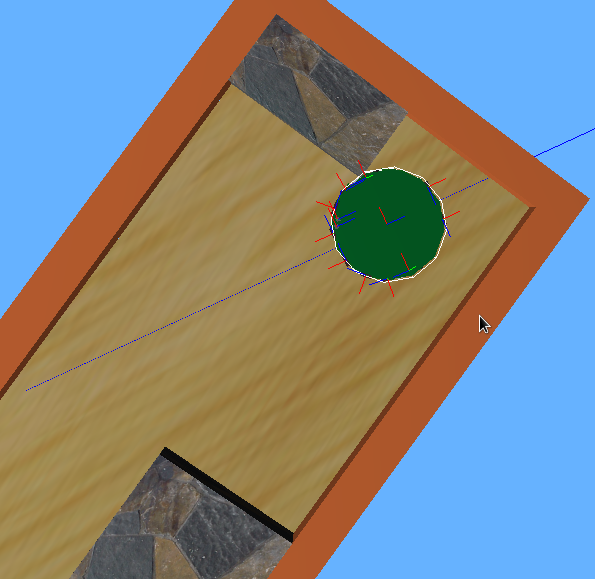
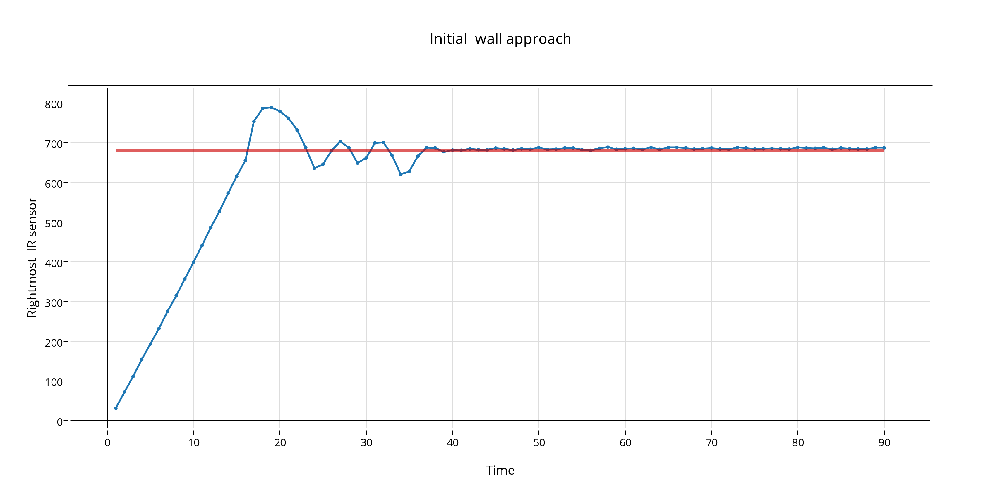
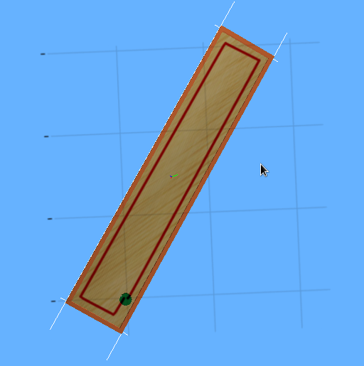
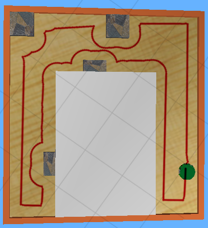

s1107546 Victor Dumitrescu | s1137931 Ignotas Sulzenko

----------------------------
# Introduction to vision and robotics - autonomous navigation

## Introduction

In this assignment we had to make a Khepera robot navigate by following a wall and keeping the distance to it constant. The robot is also supposed to circumvent any obstacles that it might encounter along the way. For this task we used the Webots simulator and implemented a PI controller that allows the robot to smoothly follow the wall together with an odometry system that lets the robot stop when it comes back to the origin.

## Methods

### Basic code structure

This is the basic outline of the control flow (in pseudocode):

    while the robot is not stuck and has not finished the lap:
        get the sensor values
        while the robot does not sense anything in front or to its right:
            move forward
        if robot has not reached its starting point:
            if there is an obstacle in front:
                set the robot speeds so that it turns left on the spot
            else calculate PI adjustments to follow the wall:
                calculate errors for the relevant sensors' values
                calculate the left and right motor speeds using P
                calculate the left and right motor speeds using I
                set the robot speeds by combining P and I results
            update the odometry values
            check if we have finished the lap
Our method prioritizes obstacle avoidance over wall tracking in order to avoid getting stuck in corners or touching the walls.

### The controller

We decided to use a PI controller for maintaining a constant distance to the wall as it seemed to offer an optimal solution based on control theory. In the interest of simplicity, we made the decision to always follow the wall on the robot's right, but we have implemented the controller so that it is easy to switch sides or choose between them.

The idea behind the controller is to set an ideal value for each of the robot's IR sensors, calculate the error at each point and compute proportional (P) and integral (I) adjustments for each of them. The adjustments for each motor are then added to their base speed in order to influence the robot's trajectory. In practice, we have decided to only use the input from 2 of the sensors (the rightmost and top-right one) for the PI controller.

We started with implementing the P component, which worked reasonably well on its own, after calibrating with the correct gains. In order to enable us to have larger speeds for our robots while also avoiding overshooting the trajectory we also implemented the integral component. With proper calibration, we found that our robot is able to maintain a fairly constant distance from the wall it is following. More detailed experimental results follow in the next section.

In the code, each component of the controller is implemented as a separate function in `kheperam/controllers/task1/`: `p_component.m` and `i_component.m`.

#### Obstacle avoidance

Although we had code that could make the robot follow the wall, we had to use some different approach to be able to escape from corners and avoid obstacles. At first, we tried running our robot with using just the front and the rightmost sensors (sensors 2, 3 and 5) and checked if there is an obstacle in front of the robot and in case there is something, we would turn on the spot. Unfortunately, after some tests we discovered that this simple approach does not always work - the robot fails to avoid corners of narrow blocks. It was tending to cur corners because it would no longer sense an obstacle in front and the distance as measured by the rightmost sensor would not be enough to determine wether we're following a wall or circumventing an obstacle.

In order to make the robot avoid every kind of obstacles we redesigned our algorithm to also use the sensor on the right diagonal (sensor 4) when checking for an obstacle. After a little a bit of experimentation with distance threshold values for the obstacle avoidance, we found a configuration which seems to solve all of our problems. As described in the Results section, however, making our robot avoid all obstacles meant incurring a small penalty on the time that it takes to stabilize the path after the robot passes an obstacle or takes a corner. This can happen because checking wether the robot is facing an obstacle will sometimes return a false positive and will engage briefly in obstacle avoidance even though the robot is just following the wall. However, the trajectory eventually stabilizes. 

### Odometry

Odometry is necessary to make the robot stop after completing a lap in the maze. Therefore, we adopted the solution suggested in the Practical 5 of Khepera robot control on Week 6 which uses the speed of the left and right wheels in order to determine the current position and the angle of the robot:

After implementing this, we discovered that taking the __speeds__ of the motors does not produce accurate results because they have slip noise associated with them. Therefore we started registering the actual wheel __rotation counts__ to update the inner robot coordinate and angle representation, which works way more precisely. We stop the robot whenever the Euclidean distance from the origin point to the current robot location is within 10 millimeters, which is pretty accurate for our purposes.

## Results
### Robot control: following the wall
Generally, the robot manages to follow a path close to the wall at a relatively constant distance. The following graph shows the reading of the rightmost proximity sensor while initially approaching a wall at an angle of approximately 45 degrees. The time step between each reading is 128ms. This shows that the PI controller is able to stabilize the robot's trajectory within 3.2s of reaching the goal distance for the first time. The base speed of the robot is 2.4cm/s.

In our testing we have found that it usually takes less time to recover from corners or obstacles. The graph below shows both the rightmost and the top-right sensor readings while taking a corner:

In this case, the trajectory is largely recovered in less than 2s. This is representative of all the corner cases in our trials.
This plot of the robot's position overlayed over an empty rectangular road shows that following the wall and taking corners is done smoothly in the absence of obstacles.

### Robot control: navigating around obstacles
Our final version of the robot manages to avoid rectangular obstacles of different shapes and sizes. A lot of calibration and changes of the rotation logic were necessary in order to avoid getting the robot stuck in the sharp edges of these obstacles, as illustrated below. We were faced with a trade-off between sometimes getting stuck in these corners and speedy recovery of a straight trajectory after an obstacle is passed. We chose to optimise for the former.

This assures that our robot has the highest chance of navigating the whole path, even though speed might slightly suffer in some cases where the trajectory oscillates for a longer interval.

_**Note:** These images are not 100% accurate as they were hand-alinged with the plot of the trajectories. They are intended to demonstrate how the obstacles are navigated, but the don't provide an accurate estimation of the distance between the robot and the different elements of the world._ 

## Discussion

We believe our results above show that we have been quite successful in making the robot autonomously navigate by following a wall, avoid different kinds of obstacles and stop precisely at the origin point. However, we realise that there are some limitations to our implementation  and there are improvements that we could make.

First of all, based on the assignment description, we assumded throughout that all obstacles are rectangular-shaped objects. Our obstacle avoidance algorithms have been tailored to avoid rectangular objects and might therefore fail when trying to avoid V-shaped objects or objects that have cavities that are too narow for the robot. In order to solve this problem, we would have to implement a more robust obstacle avoidance algorithm that possibly uses **all 8** of the sensor values and not just the 3 sensor values as it is doing currently.

Finally, we could try to make the robot move faster and increase the fluidity of its movements. For that we would need to implement the Derivative controller and use it in addition with the Proportional and Integral controllers. Although with the current speed of the robot, our controller does not have significant difficulties in achieving and maintaining the desired distance from the wall, an increase in speed would make the movement more jerky and less accurate, so a Derivative controller would become necessary.

## Work distribution
We have both made similar contributions to the assignment and thus the split should be 50:50.
_Victor -_ I have implemented the PI controller and developed an initial structure of our code based on the one provided in the assignment files. I have implemented an initial obstacle avoidance logic and spent some time trying to find the optimal gains and parameters.
_Ignotas -_ I have implemented the odometry and made the robot stop when it reaches the origin after completing a lap. Also, I have experimented with the obstacle avoidance logic and contributed some changes to it, refactored parts of the code for clarity.
_Both -_ We finalised the structure of our code together and consulted in order to improve each other's approaches and implementation. We tested the robot both individually and together. We worked together on writing this report.
